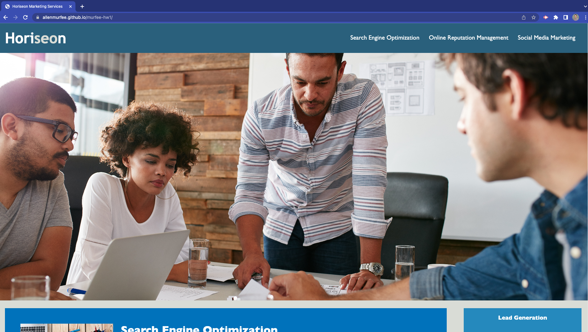

# Module 1 Challenge

## Description

This project provided us with the Horiseon marketing website HTML and CSS files and asked us to clean up the code without changing the visual aspect of the page. I did this assignment to clean up the HTML and CSS files to be more semantically friendly so those who need it can easily navigate and understand the page. I learned a lot about how to combine CSS classes and change them to element selectors, as well as how to modify HTML structure. This assignment provided a ton of div sections, which aren't good semantically, so I learned how to completely rewrite the page. It was an extremely helpful learning experience.

## Installation

No installation is required - just click the live URL (https://allenmurfee.github.io/murfee-hw1/) to view the page. Right click and view page source to see the HTML or view on my GitHub repository: https://github.com/allenmurfee/murfee-hw1

## Usage

Click the live URL to view the page: https://allenmurfee.github.io/murfee-hw1/. It should look like the below screenshot:

You can view all code files in my GitHub repository: https://github.com/allenmurfee/murfee-hw1

## Credits

I used this website for information about the aside element: https://developer.mozilla.org/en-US/docs/Web/HTML/Element/aside

I used AskBCS Learning Assistant for questions about CSS elements and semantics.

## License

MIT License
